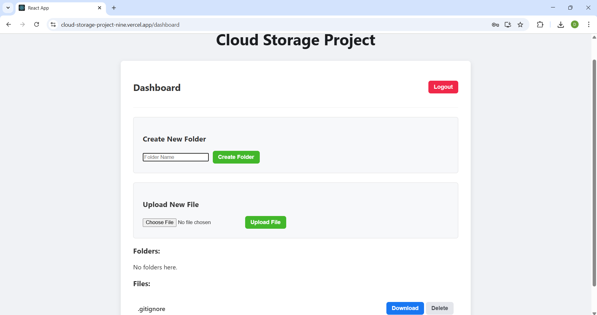

# 📁 Full-Stack Cloud Storage Project

A complete cloud file storage system built with the MERN stack (MongoDB, Express, React, Node.js). This application allows users to securely register, log in, and manage their files and folders in the cloud, similar to services like Dropbox or Google Drive.

**Live Demo:** [https://cloud-storage-project-nine.vercel.app](https://cloud-storage-project-nine.vercel.app)

---

## ✨ Features

- **Secure User Authentication**: JWT-based registration and login with password hashing.
- **File & Folder Management**: Users can create folders, upload files, download files, and delete both files and folders recursively.
- **Cloud Integration**: Connects to S3-compatible cloud storage (Backblaze B2) for robust file storage.
- **RESTful API**: A complete backend API built with Node.js and Express.
- **Modern & Responsive UI**: A polished and responsive user interface built with React, featuring a clean dashboard that works on both desktop and mobile.

---

## 🛠️ Tech Stack

- **Frontend**: React, React Router, Axios
- **Backend**: Node.js, Express.js
- **Database**: MongoDB with Mongoose
- **Cloud Storage**: Backblaze B2
- **Authentication**: JSON Web Tokens (JWT)